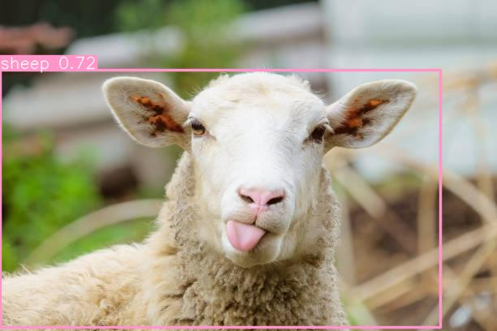

# Image classification

This is a POC to label the provided image url using the image classification model YOLO-V8

## Get started

1. Make sure you have poetry installed

```
pipx install poetry
```

2. Install dependencies

```
poetry install
```

3. Run the script using below command:

```
poetry run python3 yolov8/__main__.py
```

## Example Result

Example Image used:


Result:


